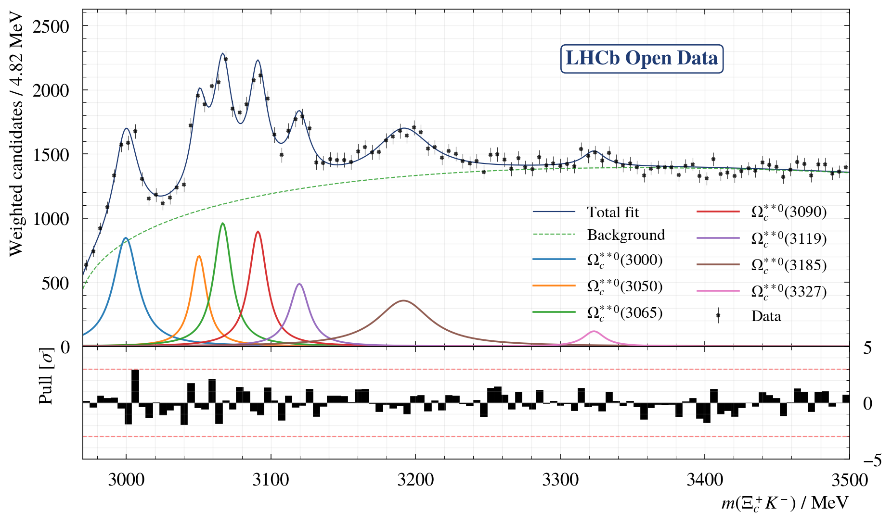

# Omega C Analysis
This is an example analysis using [LHCb Open Data](https://opendata.cern.ch/docs/lhcb-getting-started) with the [LHCb Ntupling Service](opendata-lhcb-ntupling-service.app.cern.ch/). In case you are unfamiliar, please refer to the [usage guide](https://lhcb-opendata-guide.web.cern.ch/ntupling-service/) how to obtain your own LHCb Open Data. 
For this analysis, ntuples were produced with the help of the LHCb Ntupling service with the goal to find excited $\Omega_c^0$ states in $\Omega_c^0 \rightarrow (\Xi_c^+ \rightarrow K^-p\pi^+)K^-$ decays.

## Applied Cuts
The skim uses a single offline selection. Redundant looser copies of the same cuts were removed, so only the effective cuts are listed here.

The selection keeps events with:
- `Omega_cst0_OWNPV_CHI2 / Omega_cst0_OWNPV_NDOF < 3`
- `Lambda_cplus_M` in the window `2400 < M < 2520`
- `Omega_cst0_PT > 4500`
- `Kminus_0_PT > 400`
- `Omega_cst0_ENDVERTEX_CHI2 / Omega_cst0_ENDVERTEX_NDOF < 3`
- `Lambda_cplus_ENDVERTEX_CHI2 / Lambda_cplus_ENDVERTEX_NDOF < 2`
- `Lambda_cplus_OWNPV_CHI2 / Lambda_cplus_OWNPV_NDOF < 3`
- `Lambda_cplus_ORIVX_CHI2 / Lambda_cplus_ORIVX_NDOF < 3`
- `Kminus_OWNPV_CHI2 / Kminus_OWNPV_NDOF < 3`
- `pplus_OWNPV_CHI2 / pplus_OWNPV_NDOF < 3`
- `piplus_OWNPV_CHI2 / piplus_OWNPV_NDOF < 3`
- `Kminus_0_OWNPV_CHI2 / Kminus_0_OWNPV_NDOF < 3`
- `pplus_ProbNNp > 0.9`
- `Kminus_ProbNNk > 0.8`
- `piplus_ProbNNpi > 0.8`
- `pplus_ProbNNghost < 0.1`
- `Kminus_0_ProbNNk > 0.5`

These cuts are rather strict. Please feel free to play around!!

## How to Run Me
The easiest way to use this example is through the prebuilt Harbor container.

First clone this repository.

Pull the image:
```bash
docker pull registry.cern.ch/lhcb-opendata-example-omegac-resonances/omegac-analysis:v1.0.2
```

Start a shell inside the container with your repository mounted:
```bash
docker run --rm -it -v "$PWD:/workspace" -w /workspace registry.cern.ch/lhcb-opendata-example-omegac-resonances/omegac-analysis:v1.0.2 bash
```

Inside the container, run `snakemake` directly.

### Mode 1: skim raw EOS tuples locally
This is the full workflow. It reads the raw ntuples from EOS public, runs the local skim, and then continues with plotting, sWeighting, and the final fit.

Keep `workflow.run_skim: true` in [`config.yaml`](/home/piet/Documents/opendata_example_omegac_resonances/config.yaml), then run:
```bash
snakemake --cores 1 --config max_files=1
```

Here `max_files=1` means only one raw EOS file is skimmed. Use:
```bash
snakemake --cores 1 --config max_files=0
```
to process all files. In this analysis, `max_files: 0` means "all files".

The skim step writes local skimmed ROOT files into `skimmed/`, and the later stages write their outputs into:
- `plots/maxfiles_1/...`
- `weighted/maxfiles_1/...`
- `fit/maxfiles_1/...`

### Mode 2: use already skimmed EOS tuples
If you already have skimmed files in EOS public, skip the skim stage and start from those files directly.
This is the recommended mode since filtering locally can take a long time.

Set `workflow.run_skim: false` in [`config.yaml`](/home/piet/Documents/opendata_example_omegac_resonances/config.yaml), then run:
```bash
snakemake --cores 1 --config run_skim=false
```

This mode reads the skimmed tuples from:
```text
root://eospublic.cern.ch//eos/opendata/lhcb/upload/example_omega_c_resonances/
```

You can still limit how many skimmed EOS files are used:
```bash
snakemake --cores 1 --config run_skim=false max_files=1
```

The workflow is split into four stages:
- `skim`
- `plot`
- `sweight`
- `fit`

The important output files are:
- `plots/skim/xic_mass.png`
- `plots/skim/omega_c_mass.png`
- `plots/maxfiles_*/sweight/xic_fit.png`
- `plots/maxfiles_*/sweight/omega_weighted.png`
- `weighted/maxfiles_*/omegac2xicK.root`
- `fit/maxfiles_*/omega_fit.png`
- `fit/maxfiles_*/omega_fit.json`

If you want a quick test of the full workflow, use `max_files=1`. 

Please feel free to play around with the analysis:
- change the number of files to see how the plots and fits evolve
- try different fit models or starting values
- tighten or loosen some of the cuts and compare the effect
- ...

## Example Result
For the full dataset run (`max_files=0`), the final $\Omega_c$ fit output is:



where clearly the new $\Omega_c$ states are observed!
